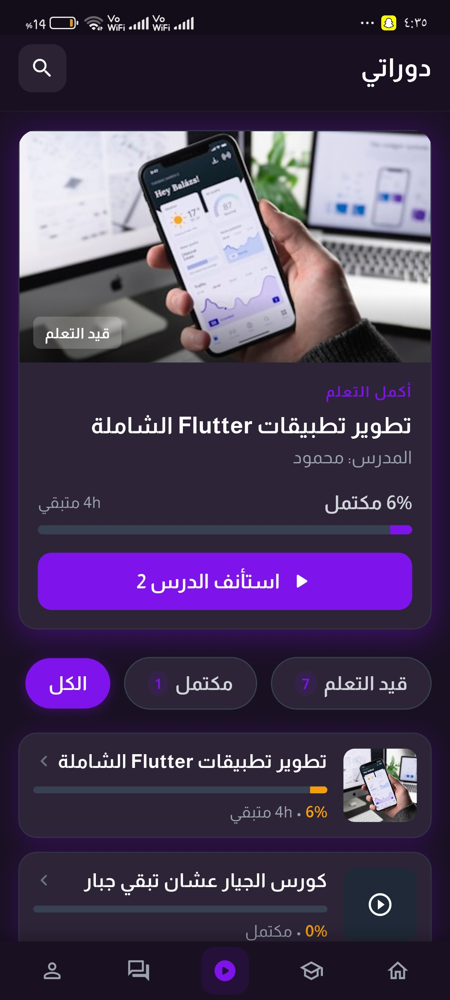
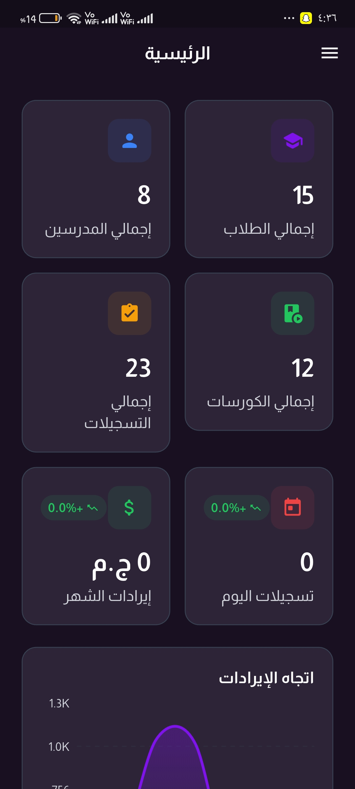
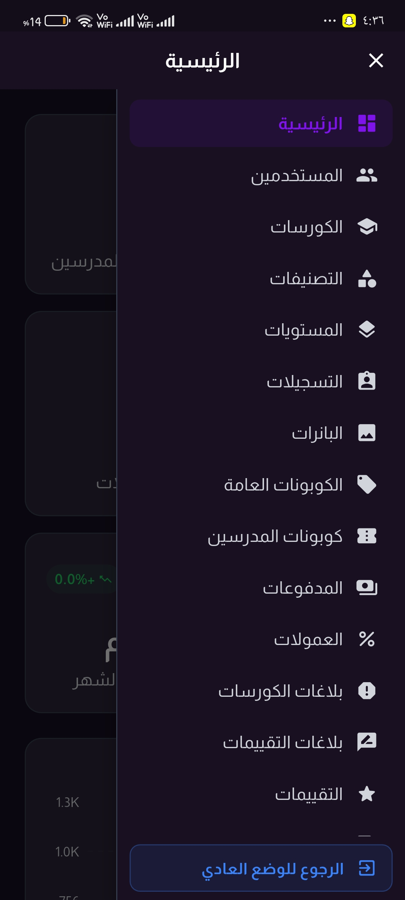
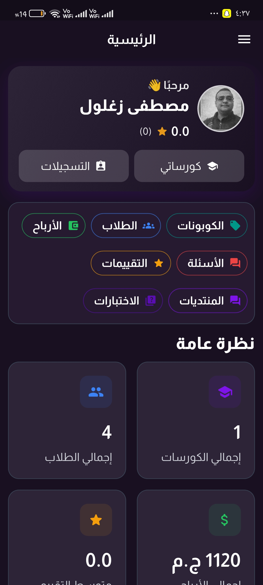
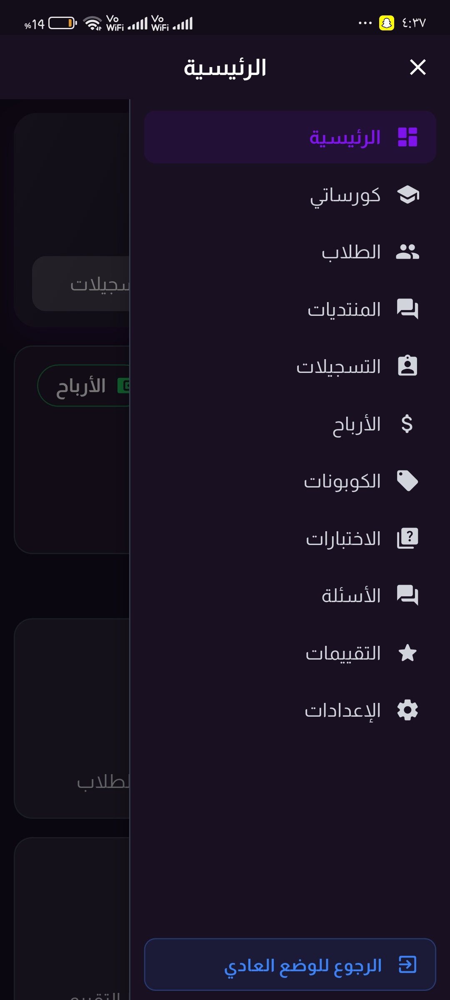
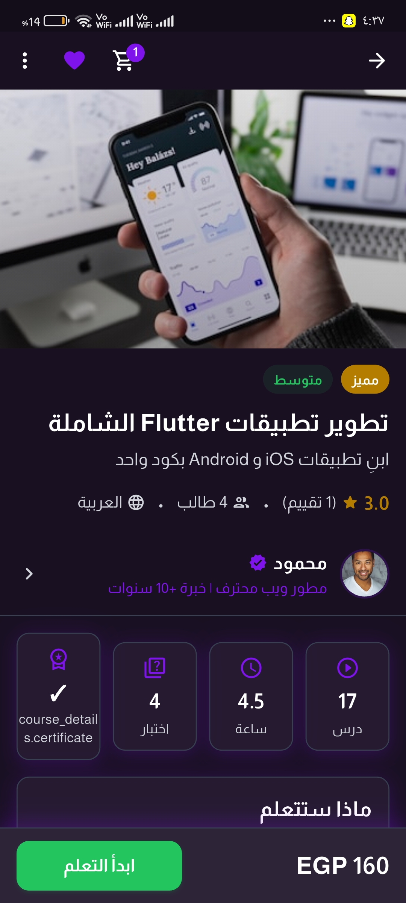

# Nero Academy

Nero Academy is a Flutter learning management app for students, instructors, admins, and parents. The app supports Arabic and English, course discovery, learning progress, quizzes, forums, direct chat, instructor tools, admin operations, parent monitoring, cart and checkout, and Paymob payments backed by Supabase.

## Screenshots

The gallery below uses all screenshots from `C:\Users\ahmed\Desktop\edu\pic`, copied into `docs/readme_screenshots/` for stable README links.

<table>
  <tr>
    <td align="center"><br><strong>Splash</strong></td>
    <td align="center"><br><strong>Student Home</strong></td>
    <td align="center"><br><strong>My Learning</strong></td>
  </tr>
  <tr>
    <td align="center"><br><strong>Messages</strong></td>
    <td align="center"><br><strong>Admin Dashboard</strong></td>
    <td align="center"><br><strong>Admin Menu</strong></td>
  </tr>
  <tr>
    <td align="center"><br><strong>Instructor Dashboard</strong></td>
    <td align="center"><br><strong>Instructor Menu</strong></td>
    <td align="center"><br><strong>Course Details</strong></td>
  </tr>
</table>

## Core Features

- Student experience: browse courses, search and filter, view details, wishlist, cart, checkout, continue learning, course player, certificates, quizzes, reviews, notifications, history, and profile settings.
- Instructor experience: dashboard metrics, course management, students, enrollments, quizzes, questions, forums, coupons, earnings, reviews, and settings.
- Admin experience: users, instructors, courses, categories, levels, enrollments, banners, coupons, payouts, commissions, reports, ratings, and platform settings.
- Parent portal: parent login/lookup flow and student progress dashboard.
- Communication: direct chat, course forums, Q&A, attachments, replies, reactions, and notifications.
- Learning tools: video playback, lesson progress, notes, bookmarks, attachments, quiz attempts, score results, and course completion flow.
- Commerce: cart, coupon support, checkout, payment success, payment history, Paymob card and wallet payment integration.
- Platform support: Android, iOS, Web, Windows, macOS, and Linux Flutter targets.

## Tech Stack

- Flutter and Dart
- Supabase for authentication, database, storage, realtime data, and edge functions
- Bloc/Cubit for state management
- GetIt for dependency injection
- GoRouter for navigation
- EasyLocalization for Arabic and English localization
- Paymob for card and wallet payments
- YouTube/video player packages for course playback
- fl_chart for dashboard charts
- PDF/printing packages for generated learning documents

## Project Structure

```text
lib/
  core/                     Shared theme, routing, services, widgets, errors, DI
  features/                 Feature-first app modules
    auth/
    home/
    course_details/
    course_player/
    cart/
    payment/
    my_learning/
    instructor_dashboard/
    admin_dashboard/
    parent_portal/
    direct_chat/
    course_forum/
    quizzes/
assets/
  translations/             Arabic and English JSON files
  fonts/                    Almarai font family
database_scripts/           Supabase SQL migrations and fixes
supabase/functions/         Supabase Edge Functions
docs/readme_screenshots/    README screenshots
test/                       Flutter widget and unit tests
```

## Requirements

- Flutter SDK with Dart `^3.5.0`
- Android Studio or VS Code with Flutter tooling
- Android SDK for Android builds
- Xcode for iOS builds on macOS
- A configured Supabase project
- Paymob merchant credentials if payment flows are enabled

## Getting Started

1. Install packages.

```bash
flutter pub get
```

2. Confirm backend configuration.

Supabase configuration is currently defined in `lib/core/constants/app_constants.dart`. Paymob configuration is currently defined in `lib/core/config/paymob_config.dart`.

For production, move private payment credentials and environment-specific values out of source code and load them through a secure configuration process.

3. Prepare the database.

Apply the SQL scripts in `database_scripts/` to your Supabase database in the intended order for your environment. The later numbered scripts contain fixes and feature additions.

4. Run the app.

```bash
flutter run
```

Run a specific target when needed:

```bash
flutter run -d chrome
flutter run -d windows
flutter run -d android
```

## Common Commands

```bash
flutter pub get
flutter analyze
flutter test
flutter build apk --release
flutter build appbundle --release
flutter build web --release
```

Regenerate native splash and launcher icons after changing assets:

```bash
dart run flutter_native_splash:create
dart run flutter_launcher_icons
```

## Localization

The app uses EasyLocalization with Arabic as the fallback and start locale. Translation files live in:

- `assets/translations/ar.json`
- `assets/translations/en.json`

The main app switches text direction automatically:

- Arabic uses RTL.
- English uses LTR.

## Routing

Navigation is centralized in `lib/core/routing/app_router.dart` with GoRouter. Main areas include:

- `/splash`
- `/login`
- `/home`
- `/instructors`
- `/my-learning`
- `/forums-tab`
- `/profile`
- `/parent_entrance`
- `/parent_dashboard`

Feature screens add their own routes for details, checkout, dashboards, quizzes, reports, and editor flows.

## Backend Notes

- Supabase initialization happens during app startup in `lib/main.dart`.
- Data access is organized by feature using data sources, repositories, use cases, cubits, and presentation screens.
- Supabase Edge Functions are stored in `supabase/functions/`.
- SQL setup and repair scripts are stored in `database_scripts/`.
- Storage buckets referenced by the app include avatars, courses, and certificates.

## Payment Notes

Paymob is initialized only when credentials are configured. The app includes support for:

- Card payments
- Wallet payments
- Payment web views
- Payment success handling
- Payment history
- Refund and payout related database scripts

Keep production credentials outside version control.

## Testing

Run the full test suite:

```bash
flutter test
```

Run static analysis:

```bash
flutter analyze
```

Current tests include shared widget coverage and feature-specific tests under `test/`.

## Build Outputs

Use Flutter build commands for each target:

```bash
flutter build apk --release
flutter build appbundle --release
flutter build web --release
flutter build windows --release
```

The generated build folders are not source files and should not be committed unless a release workflow explicitly requires artifacts.

## Notes for Maintainers

- Keep feature logic inside `lib/features/<feature_name>/`.
- Put reusable UI, services, routing, theme, constants, and error handling in `lib/core/`.
- Prefer existing shared widgets before creating new UI primitives.
- Keep Arabic and English translation keys in sync.
- Run `flutter analyze` and `flutter test` before release builds.
